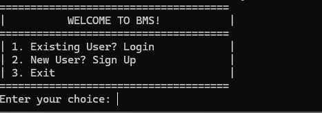
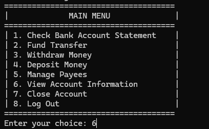
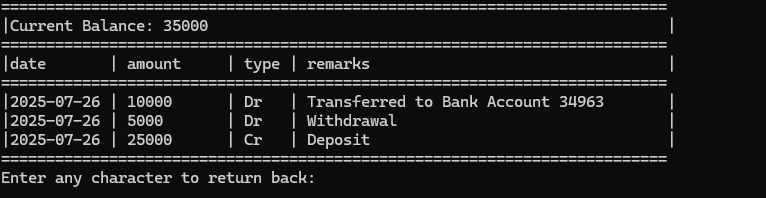

# Bank Management System (BMS)

A console-based Bank Management System implemented in C programming language that provides comprehensive banking operations including account creation, login, fund transfers, deposits, withdrawals, and payee management.

## Table of Contents
- [Features](#features)
- [Project Structure](#project-structure)
- [Data Storage Architecture](#data-storage-architecture)
- [File Formats](#file-formats)
- [How to Compile and Run](#how-to-compile-and-run)
- [Usage](#usage)
- [System Requirements](#system-requirements)
- [Code Structure](#code-structure)

## Features

### User Authentication
- **Sign Up**: Create new bank accounts with complete user details
- **Login**: Secure login using 5-digit account number and 6-digit MPIN
- **Account Management**: View account information and close accounts

### Banking Operations
- **Fund Transfer**: Transfer money to registered payees
- **Deposit Money**: Add funds to your account
- **Withdraw Money**: Withdraw funds (with balance validation)
- **Account Statement**: View transaction history with current balance
- **Balance Inquiry**: Real-time balance checking

### Payee Management
- **Add Payee**: Register new payees for fund transfers
- **View Payees**: Display all registered payees
- **Remove Payee**: Delete payees from your list

## Project Structure

```
cproject/
│
├── main.c                 # Main source code file
├── main.exe               # Compiled executable
├── userrecord.txt         # Master file for user authentication
├── README.md              # This documentation file
│
├── images/                # UI screenshots (optional)
│   ├── home.png
│   ├── main_menu.png
│   └── statement.png
│
├── [Account_Number_1]/    # Individual account folders (e.g., 12345/)
│   ├── account_details.txt
│   ├── user_statement.txt
│   └── payees.txt
│
├── [Account_Number_2]/    # Individual account folders (e.g., 67890/)
│   ├── account_details.txt
│   ├── user_statement.txt
│   └── payees.txt
│
└── [Additional Account Folders...]
```

## Data Storage Architecture

The system uses a **file-based storage architecture** with the following hierarchy:

### 1. Master Authentication File
- **File**: `userrecord.txt`
- **Purpose**: Central repository for user authentication
- **Location**: Root directory

### 2. Individual Account Folders
- **Naming**: Each folder is named with the 5-digit account number
- **Contents**: Three essential files per account
- **Auto-created**: Folders and all files are automatically created during account registration
- **Auto-managed**: All file operations (create, read, write, delete) are handled programmatically

### 3. Account-Specific Files
Each account folder contains three files (all auto-generated):
- `account_details.txt` - Complete user profile information (auto-created during signup)
- `user_statement.txt` - Transaction history and current balance (auto-updated with each transaction)
- `payees.txt` - List of registered payees for fund transfers (auto-updated when payees are added/removed)

## File Formats

### 1. userrecord.txt (Master Authentication File)
**Format**: `account_number|phone_number|name|mpin`

**Example**:
```
12345|9876543210|John Doe|123456
67890|8765432109|Jane Smith|654321
```

**Fields**:
- `account_number`: 5-digit unique bank account number
- `phone_number`: 10-digit contact number
- `name`: Account holder's full name
- `mpin`: 6-digit Mobile PIN for authentication

### 2. account_details.txt (Complete User Profile)
**Format**: `acc_num|name|email|phone|address|pan|aadhar|initial_deposit|mpin`

**Example**:
```
12345|John Doe|john.doe@email.com|9876543210|123 Main Street, City, State|ABCDE1234F|123456789012|50000|123456
```

**Fields**:
- `acc_num`: Account number (5 digits)
- `name`: Full name of account holder
- `email`: Email address
- `phone`: 10-digit phone number
- `address`: Complete postal address
- `pan`: PAN card number (10 characters)
- `aadhar`: Aadhar number (12 digits)
- `initial_deposit`: Initial deposit amount
- `mpin`: 6-digit Mobile PIN

### 3. user_statement.txt (Transaction History)
**Structure**:
- **Line 1**: Current account balance
- **Subsequent Lines**: Transaction entries

**Transaction Format**: `date|amount|type|remarks`

**Example**:
```
45000
2025-07-26|10000|Dr|Transferred to Bank Account 67890
2025-07-26|5000|Dr|Withdrawal
2025-07-26|20000|Cr|Deposit
2025-07-25|15000|Cr|Received from Bank Account 54321
```

**Transaction Types**:
- `Cr` (Credit): Money added to account (deposits, incoming transfers)
- `Dr` (Debit): Money deducted from account (withdrawals, outgoing transfers)

**Date Format**: `YYYY-MM-DD`

### 4. payees.txt (Registered Payees)
**Format**: `payee_account_number|payee_name`

**Example**:
```
67890|Jane Smith
54321|Bob Johnson
98765|Alice Wilson
```

## How to Compile and Run

### Prerequisites
- GCC compiler or any C compiler
- Windows operating system (uses Windows-specific headers)

### Compilation
```bash
gcc main.c -o main.exe
```

### Execution
```bash
./main.exe
```

## Screenshots

### Main Menu

*The welcome screen showing login and signup options*

### User Dashboard

*Main banking operations menu after successful login*

### Account Statement

*Transaction history and current balance display*

## Usage

### 1. First Time Setup
1. Run the program
2. Choose option 2 "New User? Sign Up"
3. Enter all required details:
   - Full name
   - Email address
   - 10-digit phone number
   - Complete address
   - 10-character PAN card number
   - 12-digit Aadhar number
   - 6-digit MPIN
   - Initial deposit (minimum Rs. 1000)

### 2. Login Process
1. Choose option 1 "Existing User? Login"
2. Enter your 5-digit account number
3. Enter your 6-digit MPIN

### 3. Banking Operations
After login, you can:
- Check account statement
- Transfer funds to payees
- Withdraw money
- Deposit money
- Manage payees
- View account information
- Close account
- Logout

## System Requirements

- **Operating System**: Windows
- **Compiler**: GCC or compatible C compiler
- **Memory**: Minimal (console application)
- **Storage**: Variable (depends on number of accounts and transactions)

## Code Structure

### Data Structures
```c
struct newUser {
    char name[100];
    char email[100];
    long long pn;          // 10 digits
    char address[300];
    char pan_card[11];
    long long aadhar;      // 12 digits
    char mpin[7];          // 6 digits
    int ini_dep;
    int acc_num;           // 5 digits
};

struct currentUser {
    char name[100];
    long long pn;
    int acc_num;
    char mpin[7];
};
```

### Key Functions

#### Authentication Functions
- `signUp()`: Handle new user registration
- `login()`: Authenticate existing users
- `createMainFile()`: Initialize userrecord.txt if not exists

#### File Management Functions
- `createUserFiles()`: Create account-specific folder and files
- `addUserRecord()`: Add user to master authentication file
- `addUserData()`: Store complete user details in account files

#### Banking Operation Functions
- `checkStatement()`: Display transaction history
- `fundTransfer()`: Transfer money between accounts
- `withdrawMoney()`: Withdraw funds from account
- `depositMoney()`: Deposit funds to account
- `addEntry()`: Add transaction entries to statement

#### Payee Management Functions
- `viewPayees()`: Display all registered payees
- `addPayee()`: Add new payee
- `removePayee()`: Remove existing payee
- `payeeCheck()`: Verify if payee account exists

#### Utility Functions
- `balanceCheck()`: Verify sufficient balance for transactions
- `viewAccountInformation()`: Display complete account details
- `deleteAccount()`: Close and remove account

### Security Features
- MPIN-based authentication
- Balance validation before transactions
- Payee verification before fund transfers
- Account existence validation
- Confirmation required for account deletion

## Notes

1. **Account Numbers**: Automatically generated 5-digit random numbers
2. **File Management**: All files and folders are auto-generated and auto-managed by the system
3. **Data Persistence**: All data is stored in text files and persists between sessions
4. **Transaction Tracking**: Complete audit trail with timestamps
5. **Error Handling**: Comprehensive error checking for file operations
6. **Input Validation**: Validates user inputs for data integrity
7. **Auto-Updates**: Balance and statements are automatically updated with each transaction

## Future Enhancements

- Database integration (MySQL/SQLite)
- Encryption for sensitive data
- Interest calculation
- Loan management
- Multi-currency support
- Web-based interface
- Mobile application

---

**Developed in C Programming Language**  
**File-based Storage System**  
**Console-based User Interface**
